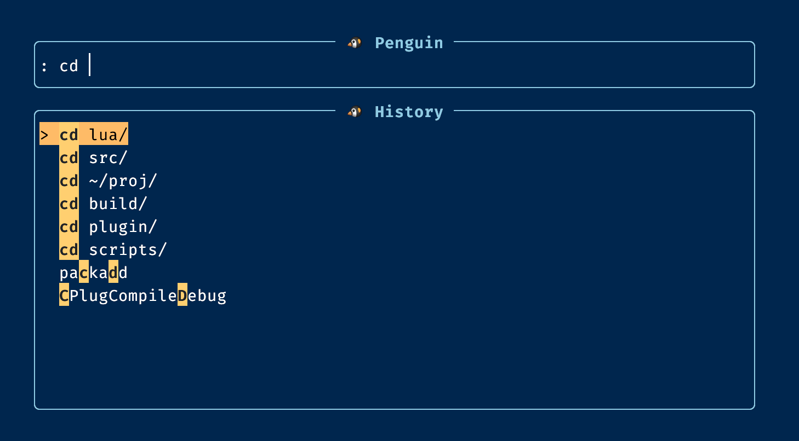

# 🐧 `penguin.nvim`

🚧 Work in progress. Still fixing a lot of stuff...



`penguin.nvim` is a command-history and command-entry picker for Neovim.
It is a lua frontend to a C backend.
It was inspired by `telescope-cmdline.nvim`, but the goal here is to make the
experience much faster and much fuzzier.

The idea is a spotlight-like interface for Neovim command entry: something
that makes it much easier to enter commands, rediscover commands, and reuse
previous commands than the default `:` prompt flow.

It is still a work in progress and still being tested, but the intended UX is:

- spotlight-like command entry for Neovim
- much faster fuzzy matching on command history and command completions
- a more ergonomic command workflow than raw `:` usage
- optional features like bare `Enter` opening the picker so command entry can
  feel more immediate in normal editing flow

## Status

Current stage:

- plugin loads
- `:Penguin` opens a floating picker
- Ex command history is collected from Neovim
- live Ex command suggestions are merged into non-empty queries
- empty query shows recent commands first
- the native matcher is the default and intended runtime path
- the plugin auto-builds the native library when it is missing
- the Lua matcher path is benchmark-only and opt-in
- selected or typed commands can be executed from the picker

## Installation

### Native Neovim

```lua
vim.opt.runtimepath:append("/Users/james/proj/penguin.nvim")
require("penguin").setup({})
```

That setup path uses the native matcher by default. If the native library is
missing, `penguin.nvim` will try to run `make native` automatically.

Experimental optional normal-mode `Enter` integration:

```lua
require("penguin").setup({
  open_on_bare_enter = true,
})
```

That is an opt-in experiment, not the default. It maps bare `Enter` in
ordinary file buffers to open `penguin.nvim`, so the plugin can own that
wiring instead of your main config.

When the plugin is loaded eagerly, that is enough on its own. With a lazy
plugin manager, `setup()` runs too late to bootstrap bare `Enter`, so the lazy
spec also needs an `Enter` trigger.

### `lazy.nvim`

```lua
{
  dir = "/Users/james/proj/penguin.nvim",
  name = "penguin.nvim",
  cmd = "Penguin",
  keys = {
    { "<M-Space>", "<cmd>Penguin<cr>", desc = "Open penguin.nvim", mode = "n" },
  },
  opts = {},
}
```

If you also want `open_on_bare_enter = true`, add a small bootstrap mapping in
`init` so lazy.nvim can load the plugin before the first bare `Enter` opens it:

```lua
{
  dir = "/Users/james/proj/penguin.nvim",
  name = "penguin.nvim",
  cmd = "Penguin",
  init = function(plugin)
    vim.keymap.set("n", "<CR>", function()
      local filetype = vim.bo.filetype

      if vim.fn.getcmdwintype() ~= "" or vim.bo.buftype ~= "" then
        return "<CR>"
      end

      if filetype == "help" or filetype == "netrw" or filetype == "qf" then
        return "<CR>"
      end

      require("lazy").load({ plugins = { plugin.name } })
      return require("penguin").handle_bare_enter()
    end, {
      desc = "Open penguin.nvim on bare Enter",
      expr = true,
      silent = true,
    })
  end,
  keys = {
    { "<M-Space>", "<cmd>Penguin<cr>", desc = "Open penguin.nvim", mode = "n" },
  },
  opts = {
    open_on_bare_enter = true,
  },
}
```

## Usage

Run:

```vim
:Penguin
```

Or press `Alt-Space` in normal mode.

If `open_on_bare_enter = true` is enabled, bare `Enter` in normal mode will
also open the picker in ordinary file buffers. That is intentionally opt-in,
and lazy setups need the bootstrap mapping above because `setup()` alone cannot
install the first `Enter` trigger before the plugin loads.

At this stage the picker opens, filters, navigates, completes, and executes commands from the prompt.

Current controls:

- type to filter
- non-empty queries can show both history hits and live command completions
- `Up` / `Down` to move
- `Ctrl-j` / `Ctrl-k` to move
- `Ctrl-n` / `Ctrl-p` to move
- `Ctrl-w` to delete the previous word
- `Enter` executes the selected item
- bare numeric queries like `30` jump directly to that line on `Enter` by default
- `Shift-Enter` executes the current text box contents directly
- `Ctrl-e` fills the text box from the selected item without executing
- `Esc` closes the picker

Config note:

- `direct_numeric_line_jumps_on_enter = true` makes fully numeric queries bypass
  the selected suggestion on plain `Enter` so `30` jumps straight to line 30

## Local Development

Manual test session with seeded command history:

```sh
make run
```

That builds the native module first and launches Neovim using [scripts/minimal_native_init.lua](/Users/james/proj/penguin.nvim/scripts/minimal_native_init.lua). It loads `penguin.nvim` from this repo, enables the current native runtime slice, and seeds a few history entries so `:Penguin` is immediately useful.

Lua baseline dev session:

```sh
make run-lua
```

That launches Neovim using [scripts/minimal_init.lua](/Users/james/proj/penguin.nvim/scripts/minimal_init.lua) and still uses the native matcher by default.

Benchmark-only Lua baseline:

```lua
require("penguin").setup({
  native = {
    benchmark_only_lua = true,
  },
})
```

Optional native stub build:

```sh
make native
```

Headless native check:

```sh
make check
```

That verifies the native loader and the current native runtime slice.

Headless Lua baseline check:

```sh
make check-lua
```

That runs [scripts/headless_check.lua](/Users/james/proj/penguin.nvim/scripts/headless_check.lua) against the default native runtime path.

Headless benchmark run:

```sh
make bench
```

That runs [scripts/headless_bench.lua](/Users/james/proj/penguin.nvim/scripts/headless_bench.lua), which compares the current Lua exact-scan baseline, native exact-scan baseline, and the current matcher runtime slice across multiple dataset sizes and query scenarios.

The benchmark output includes both raw timings and a simple ASCII bar chart per scenario.
