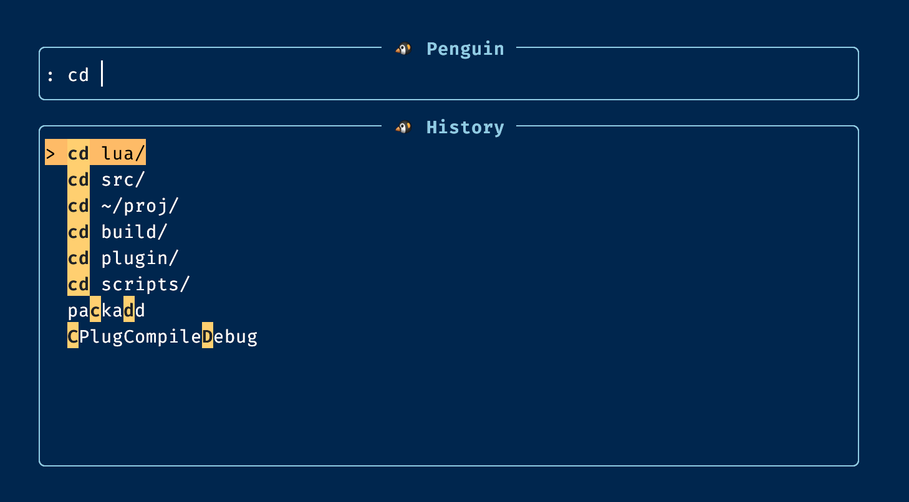

# 🐧 `penguin.nvim`

> A fast, fuzzy command palette for Neovim’s Ex history and command-line
> completions.

🚧 [Work In Progress] I put this together pretty quickly and it is not as fuzzy as FFF
but it makes my workflow easier than using `:`

<p align="center">
  
</p>

`penguin.nvim` is a spotlight-style command picker:
Search old commands and available completions, then run them without leaving
the flow. It is a Lua frontend backed by a native C matcher, inspired by
`telescope-cmdline.nvim`.

## In five seconds

| Open from Normal mode | Find | Act |
| --- | --- | --- |
| `Alt-Space`, or `Return` when enabled | Fuzzy history and live Ex completions | `Enter` runs, `Ctrl-e` fills, `Ctrl-q` deletes history |

🟢 **Native matcher by default** · ⚡ **Builds on first load** · 🧪 **Work in progress**

It is designed to feel fuzzier than Neovim’s built-in `:` command line while
keeping the command workflow close to native Neovim.

## What works today

- 🕘 Recent Ex history appears immediately for an empty query.
- 🔎 Non-empty queries merge fuzzy history hits with live command completions.
- 🚀 The native matcher is the normal runtime path; Lua matching is benchmark-only.
- ⌨️ Selected commands, direct typed commands, and numeric line jumps can all run from the prompt.
- ↵ Bare normal-mode `Enter` integration is available as an opt-in experiment.

## Installation

### Native Neovim (`vim.pack`)

```lua
vim.pack.add({
  { src = "https://github.com/jamylak/penguin.nvim", name = "penguin.nvim" },
})

require("penguin").setup({})
```

This requires Neovim 0.12+ for `vim.pack`. The default setup uses the native
matcher. On its first load, the plugin builds the native library when needed,
so `make` and a C compiler must be available. To build it ahead of time, run
`make native` from the plugin directory.

For a local checkout while developing the plugin, add it to `runtimepath` and
source its plugin file before calling `setup()`:

```lua
local penguin_dir = vim.fn.expand("~/proj/penguin.nvim")

vim.opt.rtp:append(penguin_dir)
vim.cmd.source(vim.fs.joinpath(penguin_dir, "plugin", "penguin.lua"))
require("penguin").setup({})
```

Experimental optional normal-mode `Enter` integration:

```lua
require("penguin").setup({
  open_on_bare_enter = true,
})
```

That is an opt-in experiment, not the default. It maps bare `Enter` in
ordinary file buffers to open `penguin.nvim`, so the plugin can own that
wiring instead of your main config.

When the plugin is loaded eagerly, that is enough on its own. With a lazy
plugin manager, `setup()` runs too late to bootstrap bare `Enter`, so the lazy
spec also needs an `Enter` trigger.

### `lazy.nvim`

```lua
{
  "jamylak/penguin.nvim",
  cmd = "Penguin",
  keys = {
    { "<M-Space>", "<cmd>Penguin<cr>", desc = "Open penguin.nvim", mode = "n" },
  },
  opts = {},
}
```

If you also want `open_on_bare_enter = true`, add a small bootstrap mapping in
`init` so lazy.nvim can load the plugin before the first bare `Enter` opens it:

```lua
{
  "jamylak/penguin.nvim",
  cmd = "Penguin",
  init = function(plugin)
    vim.keymap.set("n", "<CR>", function()
      local filetype = vim.bo.filetype

      if vim.fn.getcmdwintype() ~= "" or vim.bo.buftype ~= "" then
        return "<CR>"
      end

      if filetype == "help" or filetype == "netrw" or filetype == "qf" then
        return "<CR>"
      end

      require("lazy").load({ plugins = { plugin.name } })
      return require("penguin").handle_bare_enter()
    end, {
      desc = "Open penguin.nvim on bare Enter",
      expr = true,
      silent = true,
    })
  end,
  keys = {
    { "<M-Space>", "<cmd>Penguin<cr>", desc = "Open penguin.nvim", mode = "n" },
  },
  opts = {
    open_on_bare_enter = true,
  },
}
```

## Usage

The recommended workflow is to open the picker from Normal mode with
`Alt-Space`. If you enable bare `Return` integration, `Return` is an equally
quick way to open it in ordinary file buffers.

`:Penguin` remains available when a command is more convenient:

```vim
:Penguin
```

If `open_on_bare_enter = true` is enabled, bare `Enter` in normal mode will
also open the picker in ordinary file buffers. That is intentionally opt-in,
and lazy setups need the bootstrap mapping above because `setup()` alone cannot
install the first `Enter` trigger before the plugin loads.

The picker filters, navigates, completes, and executes commands from the prompt.

### Controls

| Key | Action |
| --- | --- |
| Type | Filter history and command completions |
| `Up` / `Down` or `Ctrl-n` / `Ctrl-p` | Move selection |
| `Enter` or `Ctrl-j` | Run the selected item |
| `Shift-Enter` | Run the text currently in the prompt |
| `Ctrl-e` or `Tab` | Fill the prompt from the selected item |
| `Ctrl-k` / `Ctrl-w` | Delete after cursor / previous word |
| `Ctrl-q` | Delete the selected history entry and write ShaDa |
| `Esc` or `Ctrl-c` | Close the picker |

Bare numeric queries such as `30` jump to that line on `Enter` by default.

### Enter behavior

- `direct_submit_on_enter_commands` makes exact command queries bypass the
  selected suggestion on plain `Enter`; defaults are `:bd`, `:noh`, `:q`,
  `:q!`, `:qa`, `:qa!`, `:w`, `:w!`, `:wq`, and `:x`
- `direct_numeric_line_jumps_on_enter = true` makes fully numeric queries bypass
  the selected suggestion on plain `Enter` so `30` jumps straight to line 30
- `submit_on_enter_if_no_matches = true` (default) makes plain `Enter` execute
  the current query if there are no suggestions showing, instead of doing nothing

## Local Development

Manual test session with seeded command history:

```sh
make run
```

That builds the native module first and launches Neovim using
[scripts/minimal_native_init.lua](scripts/minimal_native_init.lua). It loads
this checkout, uses a 100-row result window, and seeds command history for
manual picker testing.

Standard dev session (the `run-lua` target name is retained for compatibility):

```sh
make run-lua
```

That launches Neovim using [scripts/minimal_init.lua](scripts/minimal_init.lua)
and the normal plugin defaults. It therefore still uses the native matcher by
default and will build it on first load if necessary.

Benchmark-only Lua baseline:

```lua
require("penguin").setup({
  native = {
    benchmark_only_lua = true,
  },
})
```

Manual native build:

```sh
make native
```

Headless native check:

```sh
make check
```

That verifies the native loader, matcher, and picker behavior.

Headless standard check:

```sh
make check-lua
```

That runs [scripts/headless_check.lua](scripts/headless_check.lua) against the
default native runtime path.

Headless benchmark run:

```sh
make bench
```

That runs the default quick profile from
[scripts/headless_bench.lua](scripts/headless_bench.lua), comparing the Lua
baseline and native matcher paths across routine benchmark scenarios.

Focused 100-row visible-list benchmark:

```sh
make bench-visible100
```

That runs only the `visible100` scenario, including the `selection_render_runtime` slice that measures repeated selection movement through a 100-row rendered list.

Full long benchmark run:

```sh
make bench-long
```

The benchmark output includes both raw timings and a simple ASCII bar chart per scenario.
